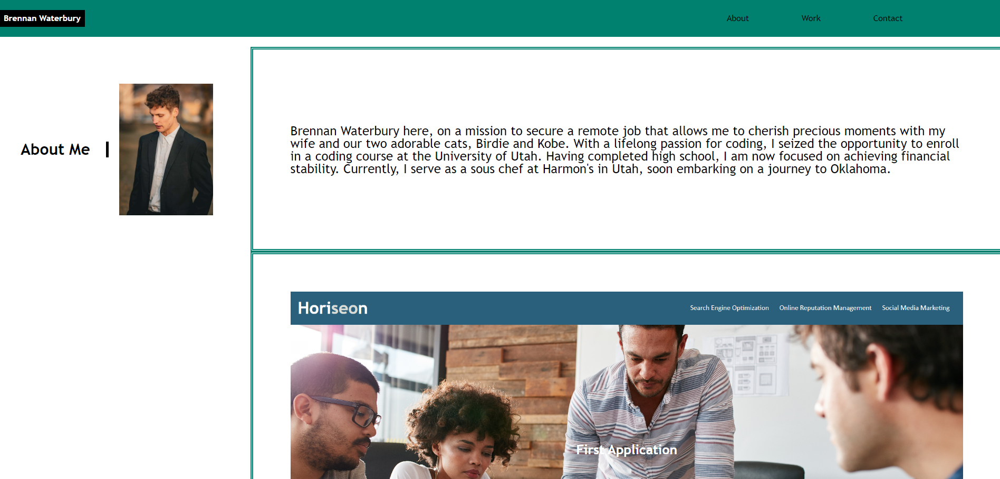
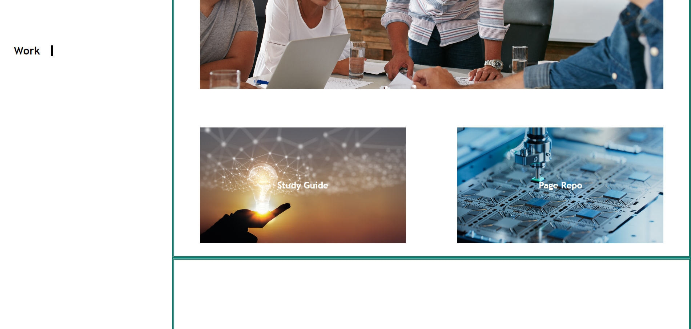
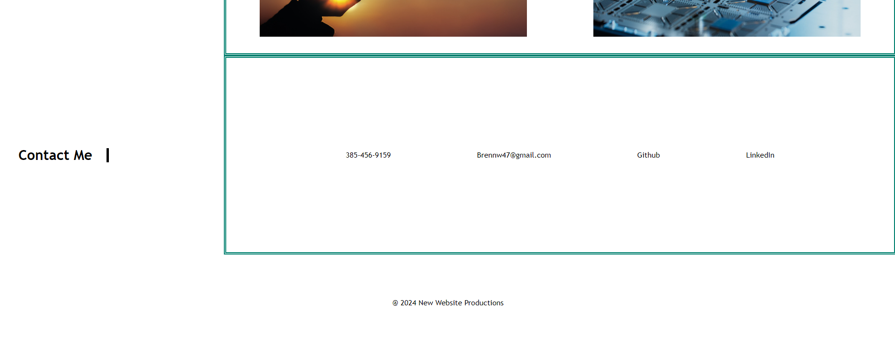

# Prime Nex
Landing Page

## Description
Welcome to my professional portfolio, where I invite you to explore my journey and accomplishments.

In the "About Me" section, you'll discover insights into my professional background, passions, and aspirations. From my early career experiences to my current endeavors, I'm excited to share my story with you.

The "Work" section showcases a selection of my notable projects and contributions. Dive into these projects to gain a deeper understanding of my skills, creativity, and problem-solving abilities. Each project represents a unique challenge and opportunity for growth.

Looking to get in touch? Head over to the "Contact" section, where you'll find various ways to connect with me. Whether you have a question, a collaboration proposal, or just want to say hello, I'm always eager to engage with fellow professionals and enthusiasts.

Thank you for visiting my portfolio. I hope you find inspiration and insight as you explore my journey. Feel free to reach out—I'd love to hear from you!

## Badges
Shields.io

## Visuals
Link: <a href="https://bwater47.github.io/Prime-Nex/">Landing Page</a>
Screenshot:   

## Installation
N/A

## Usage
You may use the website for gaining information on SEO, Online Reputation Management, and Social Media Marketing.

## Support
You can contact support through email by emailing brennw47@gmail.com.

## Roadmap
N/A

## Contributing
Contributing is allowed if you're in the U of U Coding Bootcamp. Contact me on on the slack channel for information.

## Authors and acknowledgment
Bootcamp Spot. (03/09/2024). https://bootcampspot.com/

Chatgpt. ChatGPT. (03/09/2024). https://openai.com/chatgpt

• Please note: While ChatGPT was utilized to generate dialog content for the README file, it was not involved in the generation of any code, HTML edits, CSS edits, or other assets within the repository apart from this README specifically.

• All other sources, links, and information utilized within the project were obtained from the provided sources mentioned above. This includes class materials, modules, TA guidance, instructor-provided resources, as well as communication through platforms such as Slack or Discord. Additionally, numerous links and resources were provided within the assignment instructions and demonstrated during class sessions.

## Project status
N/A